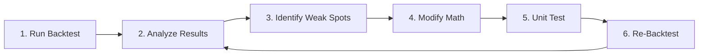

# Backtest Improvement Cycle

## Overview

This workflow describes the iterative process of improving the market analyzer's accuracy through backtesting, analysis, and targeted mathematical adjustments.



---

## Phase 1: Run Backtest

### Steps
1. Navigate to **Replay Backtest** page in frontend
2. Configure parameters:
   - **Time Range**: Pick a period with varied market conditions
   - **Step Size**: 1h for macro, 30m for scalping analysis
   - **Horizon**: Match your trading style (MICRO = 2-8h, MACRO = 1-5d)
3. Click **Run Backtest**
4. Wait for completion, then click **Label Outcomes**

### Key Files
- `frontend/src/ReplayBacktestPage.jsx` - UI
- `src/backtest/replayRunner.js` - Batch execution logic
- `src/backtest/outcomeLabelingJob.js` - Outcome labeling

---

## Phase 2: Analyze Results

### Metrics to Review
| Metric | Good | Needs Work |
|--------|------|------------|
| Overall Accuracy | >55% | <50% |
| Directional Accuracy | >60% | <55% |
| High-Confidence Accuracy | >65% | <60% |
| Confidence Calibration | Monotonic | Inverted |

### What to Look For
1. **By Bias**: LONG vs SHORT performance gap?
2. **By Regime**: Which regimes have lowest accuracy?
3. **By Confidence**: Does higher confidence = higher accuracy? (Should be!)
4. **False Positives**: High-confidence CONTINUATION calls that became REVERSAL

### Key File
- `src/backtest/scoreboardService.js` - Accuracy calculations

---

## Phase 3: Identify Weak Spots

### Common Patterns

| Symptom | Likely Cause | File to Check |
|---------|--------------|---------------|
| LONG accuracy much lower than SHORT | OI/CVD thresholds biased | `marketMetrics.js` → `interpretOpenInterest`, `interpretCVD` |
| High-confidence calls fail | Gating thresholds too loose | `marketMetrics.js` → `calculateWeightedDecision` |
| Regime misclassification | Regime logic flawed | `marketMetrics.js` → `classifyMarketRegime` |
| Absorption signals wrong | CVD detection needs tuning | `marketMetrics.js` → `detectAbsorption`, `CVD_THRESHOLDS` |
| Funding rate misleading | Wrong weight or interpretation | `marketMetrics.js` → `interpretFundingRate` |

---

## Phase 4: Modify Mathematics

### Where to Make Changes

1. **Thresholds** (easiest, lowest risk)
   - Located in `src/services/marketMetrics.js` near top of file
   - Examples: `CVD_THRESHOLDS`, `OI_THRESHOLDS`, `FUNDING_THRESHOLDS`

2. **Weights** (medium risk)
   - `calculateWeightedDecision()` contains signal weights
   - Adjust `weight` values for each signal

3. **Interpretation Logic** (higher risk)
   - `interpretOpenInterest()`, `interpretCVD()`, `interpretFundingRate()`
   - Change how raw data maps to signals

4. **Gating / Confidence Adjustments** (highest risk)
   - `calculateWeightedDecision()` final blocks
   - Confidence penalties, minimum thresholds

### Best Practices
- **Change ONE thing at a time**
- **Document the change** (comment with date and reason)
- **Note the baseline** before changing

---

## Phase 5: Unit Test

### Quick Validation
```bash
// turbo
node tests/testAbsorptionLogic.js
```

### What to Check
- No crashes or exceptions
- Existing test cases still pass
- New edge cases covered

### Key Files
- `tests/testAbsorptionLogic.js` - Absorption detection tests
- `tests/testUltimateMetrics.js` - General metric tests (if exists)

---

## Phase 6: Re-Backtest

### Compare Results
1. Run backtest with **same parameters** as Phase 1
2. Compare:
   - Overall accuracy: improved?
   - Target metric (the weak spot): fixed?
   - Other metrics: didn't regress?

### Decision Matrix
| Overall | Target | Others | Action |
|---------|--------|--------|--------|
| ↑ | ↑ | → | ✅ Keep change |
| ↑ | ↑ | ↓ | ⚠️ Review tradeoff |
| → | ↑ | → | ✅ Keep change |
| ↓ | ↑ | ↓ | ❌ Revert, rethink |
| ↓ | ↓ | ↓ | ❌ Revert immediately |

---

## File Reference

| Purpose | File |
|---------|------|
| Core Analysis Logic | `src/services/marketMetrics.js` |
| Absorption Detection | `src/services/absorptionService.js` |
| Replay Execution | `src/backtest/replayRunner.js` |
| Outcome Labeling | `src/backtest/outcomeLabelingJob.js` |
| Scoreboard Stats | `src/backtest/scoreboardService.js` |
| State Persistence | `src/services/stateStorage.js` |
| API Routes (Replay) | `src/routes/replayRoutes.js` |
| API Routes (Live) | `src/routes/marketAnalyzer.js` |
| Unit Tests | `tests/testAbsorptionLogic.js` |

---

## Example Iteration

**Scenario**: LONG calls have 45% accuracy vs SHORT at 62%

1. **Hypothesis**: OI interpretation favors SHORT signals
2. **Check**: `marketMetrics.js` → `interpretOpenInterest()`
3. **Find**: Threshold for "bullish OI divergence" too strict
4. **Change**: Lower threshold from 2% to 1.5%
5. **Test**: Run `node tests/testAbsorptionLogic.js`
6. **Backtest**: Same 24h period as before
7. **Result**: LONG accuracy now 52%, SHORT still 60%
8. **Outcome**: ✅ Keep change, continue iterating
